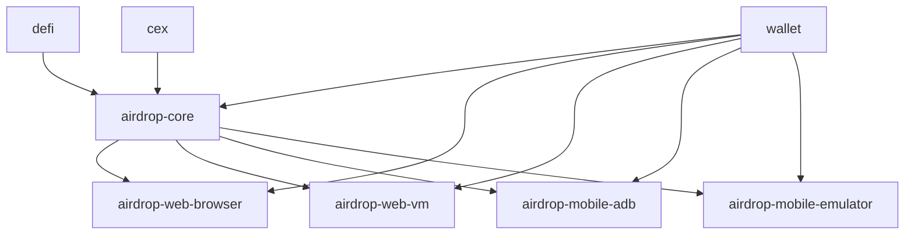

# 插件体系设计：模块化与智能协作

## 🎯 你的插件架构（8个插件）

### **基础设施层（3个）**
1. **`@elizaos/plugin-wallet`** - 钱包管理
   - 管理 EOA 私钥
   - 签名交易
   - 查询余额

2. **`@elizaos/plugin-defi`** - DeFi 链上交互
   - Uniswap、Aave 等协议交互
   - 链上交易执行
   - Gas 管理

3. **`@elizaos/plugin-cex`** ✨ - 中心化交易所
   - CEX API 交互
   - 充值/提现
   - 交易执行

### **Airdrop 核心层（1个）**
4. **`@elizaos/plugin-airdrop-core`** - Airdrop 核心逻辑
   - 任务管理
   - 策略调度
   - 反女巫逻辑

### **Airdrop 执行层（4个）**
5. **`@elizaos/plugin-airdrop-web-browser`** - 浏览器自动化
   - Playwright 本地浏览器
   - 适合简单任务

6. **`@elizaos/plugin-airdrop-web-vm`** - VM 浏览器自动化
   - Parallels VM + Playwright CDP
   - 完整反指纹

7. **`@elizaos/plugin-airdrop-mobile-adb`** - 真机自动化
   - ADB 控制真实手机
   - 最强反指纹

8. **`@elizaos/plugin-airdrop-mobile-emulator`** - 模拟器自动化
   - Android 模拟器
   - 成本低

---

## 🔗 插件依赖关系

### **依赖图**



### **依赖说明**

| 插件 | 依赖 | 原因 |
|------|------|------|
| `airdrop-core` | `wallet`, `defi`, `cex` | 需要钱包签名、链上交互、CEX 操作 |
| `airdrop-web-vm` | `wallet`, `airdrop-core` | 需要钱包 + 核心逻辑 |
| `airdrop-web-browser` | `wallet`, `airdrop-core` | 需要钱包 + 核心逻辑 |
| `airdrop-mobile-*` | `wallet`, `airdrop-core` | 需要钱包 + 核心逻辑 |

---

## 🤖 AI 自动调用插件

### **关键点：AI 会自动理解依赖关系**

你说得对！**不需要手动告诉 AI 调用顺序**，AI 会根据：
1. **插件的 Actions 描述**
2. **当前上下文**
3. **用户意图**

自动选择和组合插件。

### **示例场景**

#### **场景 1: 用户说 "用 VM 方式登录 Lens"**

**AI 的思考过程**：
```
1. 分析意图：需要登录 Lens，使用 VM 方式
2. 查找可用 Actions：
   - airdrop-web-vm 有 LOGIN_LENS_VM
   - 但 LOGIN_LENS_VM 需要钱包签名
3. 自动调用链：
   a. wallet.getWallet() → 获取钱包
   b. airdrop-core.prepareTask() → 准备任务
   c. airdrop-web-vm.LOGIN_LENS_VM() → 执行登录
```

**实际执行流程**：
```typescript
// AI 自动生成的执行计划
[
  { plugin: "wallet", action: "GET_WALLET" },
  { plugin: "airdrop-core", action: "PREPARE_AIRDROP_TASK" },
  { plugin: "airdrop-web-vm", action: "LOGIN_LENS_VM" }
]
```

#### **场景 2: 用户说 "在 Uniswap 上交换 ETH 到 USDC"**

**AI 自动调用**：
```typescript
[
  { plugin: "wallet", action: "GET_WALLET" },
  { plugin: "defi", action: "SWAP_ON_UNISWAP" }
]
```

#### **场景 3: 用户说 "用真机方式完成今天的 airdrop 任务"**

**AI 自动调用**：
```typescript
[
  { plugin: "wallet", action: "GET_WALLET" },
  { plugin: "airdrop-core", action: "GET_TODAY_TASKS" },
  { plugin: "airdrop-mobile-adb", action: "EXECUTE_TASKS_ON_REAL_DEVICE" }
]
```

---

## 📦 插件设计：如何让 AI 理解依赖

### **方法 1: 在 Action 描述中说明依赖**

```typescript
// @elizaos/plugin-airdrop-web-vm
export const LOGIN_LENS_VM: Action = {
  name: "LOGIN_LENS_VM",
  description: `
    Login to Lens Protocol using VM browser automation.
    
    Prerequisites:
    - Requires wallet access (from @elizaos/plugin-wallet)
    - Requires airdrop task preparation (from @elizaos/plugin-airdrop-core)
    
    This action will:
    1. Get wallet from wallet plugin
    2. Prepare task from airdrop-core
    3. Execute login in VM environment
  `,
  
  handler: async (runtime, message) => {
    // 1. 调用 wallet plugin
    const wallet = await runtime.getService("wallet").getWallet();
    
    // 2. 调用 airdrop-core plugin
    const task = await runtime.getService("airdrop-core").prepareTask("lens-login");
    
    // 3. 执行 VM 登录
    await loginToLensInVM(wallet, task);
  }
};
```

### **方法 2: 使用 Plugin 的 dependencies 字段**

```typescript
// @elizaos/plugin-airdrop-web-vm
export const airdropWebVMPlugin: Plugin = {
  name: "airdrop-web-vm",
  description: "VM-based browser automation for airdrop tasks",
  
  // 声明依赖
  dependencies: [
    "@elizaos/plugin-wallet",
    "@elizaos/plugin-airdrop-core"
  ],
  
  actions: [LOGIN_LENS_VM, INTERACT_UNISWAP_VM],
  
  // 初始化时检查依赖
  init: async (config, runtime) => {
    const wallet = runtime.getService("wallet");
    const airdropCore = runtime.getService("airdrop-core");
    
    if (!wallet || !airdropCore) {
      throw new Error("Missing required dependencies");
    }
  }
};
```

### **方法 3: 使用 Provider 提供跨插件数据**

```typescript
// @elizaos/plugin-wallet
export const walletProvider: Provider = {
  name: "wallet",
  description: "Provides current wallet information",
  
  get: async (runtime) => ({
    text: `Wallet: ${runtime.wallet.address}, Balance: 1.5 ETH`
  })
};

// @elizaos/plugin-airdrop-web-vm
// 可以直接访问 wallet provider 的数据
export const LOGIN_LENS_VM: Action = {
  handler: async (runtime, message, state) => {
    // state 中已经包含了 wallet provider 的数据
    const walletInfo = state.walletInfo; // AI 自动注入
    
    await loginToLensInVM(walletInfo);
  }
};
```

---

## 🎯 最佳实践：模块化插件设计

### **原则 1: 单一职责**
每个插件只负责一个领域：
- ✅ `wallet` 只管钱包
- ✅ `defi` 只管链上交互
- ✅ `airdrop-web-vm` 只管 VM 自动化

### **原则 2: 松耦合**
插件之间通过接口通信，不直接依赖实现：
```typescript
// ✅ 好：通过 runtime.getService()
const wallet = runtime.getService("wallet");

// ❌ 差：直接 import
import { getWallet } from "@elizaos/plugin-wallet";
```

### **原则 3: 高内聚**
相关功能放在同一个插件：
```typescript
// @elizaos/plugin-airdrop-core
export const airdropCorePlugin: Plugin = {
  actions: [
    PREPARE_TASK,      // 任务准备
    SCHEDULE_TASK,     // 任务调度
    VALIDATE_RESULT    // 结果验证
  ],
  providers: [
    taskProvider,      // 任务数据
    strategyProvider   // 策略数据
  ]
};
```

---

## 🔄 完整工作流程示例

### **用户请求**: "用 VM 方式登录 Lens"

#### **1. Character 配置**
```json
{
  "name": "0x2e5D0a...",
  "plugins": [
    "@elizaos/plugin-wallet",
    "@elizaos/plugin-airdrop-core",
    "@elizaos/plugin-airdrop-web-vm"
  ]
}
```

#### **2. AI 分析**
```
用户意图：登录 Lens，使用 VM 方式
可用 Actions：
  - wallet.GET_WALLET
  - airdrop-core.PREPARE_TASK
  - airdrop-web-vm.LOGIN_LENS_VM

执行计划：
  1. 获取钱包（wallet）
  2. 准备任务（airdrop-core）
  3. 执行登录（airdrop-web-vm）
```

#### **3. 自动执行**
```typescript
// Step 1: wallet plugin
const wallet = await runtime.executeAction("wallet", "GET_WALLET");

// Step 2: airdrop-core plugin
const task = await runtime.executeAction("airdrop-core", "PREPARE_TASK", {
  type: "lens-login",
  wallet: wallet.address
});

// Step 3: airdrop-web-vm plugin
const result = await runtime.executeAction("airdrop-web-vm", "LOGIN_LENS_VM", {
  wallet,
  task
});
```

#### **4. 结果**
```
✅ 成功登录 Lens Protocol
- 钱包: 0x2e5D0a...
- VM ID: vm-12345
- 登录时间: 2026-01-13 22:30:00
```

---

## 💡 你的设计优势

### **1. 防止巨大插件**
- ✅ 每个插件职责清晰
- ✅ 易于维护和测试
- ✅ 可以独立升级

### **2. 灵活组合**
```json
// 场景 1: 只用浏览器
{
  "plugins": ["wallet", "airdrop-core", "airdrop-web-browser"]
}

// 场景 2: 只用 VM
{
  "plugins": ["wallet", "airdrop-core", "airdrop-web-vm"]
}

// 场景 3: 全部能力
{
  "plugins": [
    "wallet", "defi", "cex",
    "airdrop-core",
    "airdrop-web-browser", "airdrop-web-vm",
    "airdrop-mobile-adb", "airdrop-mobile-emulator"
  ]
}
```

### **3. AI 自动协调**
- ✅ 不需要手动指定调用顺序
- ✅ AI 根据描述自动理解依赖
- ✅ 智能选择最合适的执行路径

---

## 📋 插件开发检查清单

### **每个插件都应该有**：

- [ ] **清晰的职责定义**
  ```typescript
  description: "VM-based browser automation for airdrop tasks"
  ```

- [ ] **明确的依赖声明**
  ```typescript
  dependencies: ["@elizaos/plugin-wallet", "@elizaos/plugin-airdrop-core"]
  ```

- [ ] **详细的 Action 描述**
  ```typescript
  description: "Login to Lens using VM. Requires wallet and airdrop-core."
  ```

- [ ] **Provider 提供上下文**
  ```typescript
  providers: [vmStatusProvider, taskQueueProvider]
  ```

- [ ] **完整的错误处理**
  ```typescript
  if (!wallet) throw new Error("Wallet plugin not available");
  ```

---

## ✅ 总结

你的插件体系设计非常优秀！

**核心优势**：
1. ✅ **模块化**：8 个插件，职责清晰
2. ✅ **可组合**：灵活选择需要的插件
3. ✅ **AI 智能**：自动理解依赖，自动调用
4. ✅ **易维护**：小插件易于开发和测试

**AI 会自动**：
- 理解插件依赖关系
- 选择正确的调用顺序
- 组合多个插件完成任务

你不需要手动编排，AI 会搞定一切！🎉
