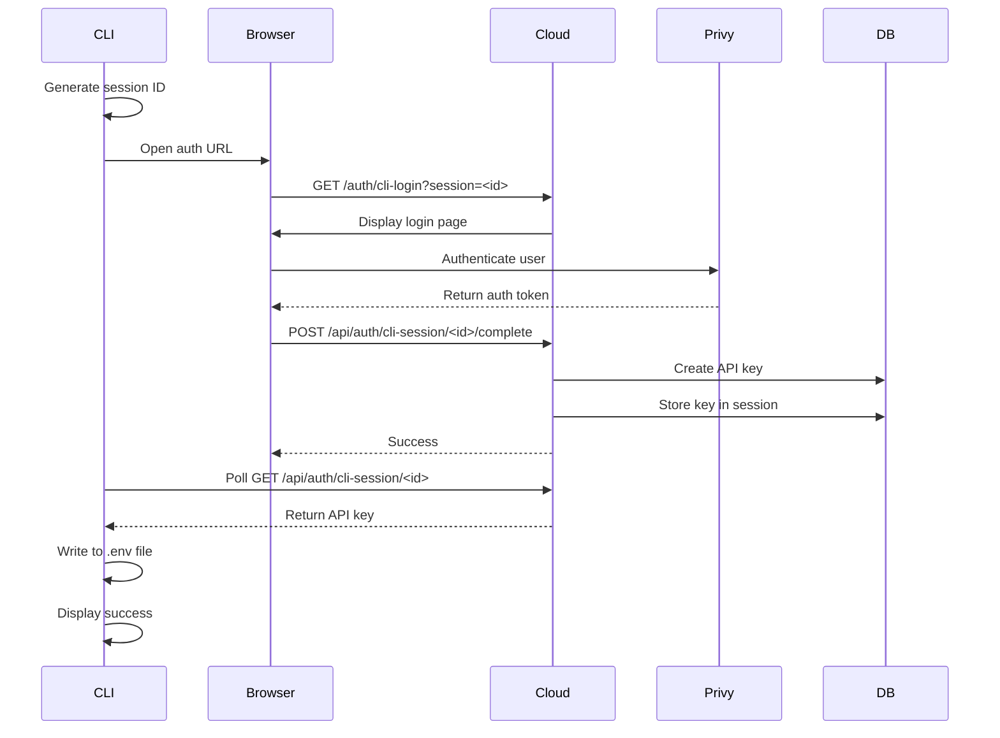

# ElizaOS Cloud Login Command

The `elizaos login` command provides secure authentication with ElizaOS Cloud, generating an API key that enables CLI users to access cloud-hosted features and services.

## Overview

This command implements a secure OAuth-like flow where:

1. CLI generates a unique session ID
2. Opens browser to ElizaOS Cloud authentication page
3. User logs in via Privy (or reuses existing session)
4. Cloud generates an API key for the user
5. CLI polls for completion and retrieves the key
6. API key is automatically written to project `.env` file

## Usage

```bash
# Basic usage (opens browser automatically, uses production cloud)
elizaos login

# Local development (override to use localhost)
elizaos login --cloud-url http://localhost:3000

# Don't open browser (manual authentication)
elizaos login --no-browser

# Increase timeout for slow connections
elizaos login --timeout 600
```

## Options

- `--cloud-url <url>` - URL of ElizaOS Cloud (default: `$ELIZA_CLOUD_URL` or `https://www.elizacloud.ai`)
- `--no-browser` - Don't automatically open browser (displays URL for manual access)
- `--timeout <seconds>` - Authentication timeout in seconds (default: `300`)

## Authentication Flow



## Environment Variables

The command writes the following variable to your project's `.env` file:

```bash
ELIZAOS_API_KEY=eliza_<random_hex_string>
```

You can also set a default cloud URL:

```bash
export ELIZA_CLOUD_URL=https://www.elizacloud.ai
```

## Security Features

1. **Session Expiry**: Authentication sessions expire after 15 minutes
2. **One-Time Retrieval**: API key can only be retrieved once from the session
3. **Automatic Cleanup**: Expired sessions are cleaned up by a cron job
4. **Secure Storage**: Plain API key is only stored temporarily during the authentication flow
5. **No Credentials in CLI**: CLI never handles user passwords or Privy tokens

## API Endpoints

The cloud project provides these endpoints for CLI authentication:

- `POST /api/auth/cli-session` - Create a new authentication session
- `GET /api/auth/cli-session/[sessionId]` - Poll for session status and retrieve API key
- `POST /api/auth/cli-session/[sessionId]/complete` - Complete authentication after Privy login

## Error Handling

The command handles various error scenarios:

- **Network Errors**: Retries with exponential backoff
- **Timeout**: Clear message with suggestion to increase timeout
- **Expired Session**: Prompts user to try again
- **Browser Issues**: Displays manual URL if auto-open fails
- **File System Errors**: Shows manual instructions for adding key to `.env`

## Testing

```bash
# Run unit tests
cd packages/cli
bun test src/commands/login

# Test the login flow (requires cloud to be running)
elizaos login --cloud-url http://localhost:3000
```

## Development

### File Structure

```
packages/cli/src/commands/login/
├── index.ts                 # Command definition
├── types.ts                 # TypeScript interfaces
├── actions/
│   └── login.ts            # Main login handler
└── utils/
    ├── session.ts          # Session ID generation
    ├── browser.ts          # Cross-platform browser opening
    └── polling.ts          # Auth status polling logic
```

### Adding New Features

To extend the login command:

1. Add new options in `index.ts`
2. Update `LoginOptions` type in `types.ts`
3. Implement logic in `actions/login.ts`
4. Add utility functions to `utils/` as needed

## Integration with Cloud

The cloud project must have:

1. Database table: `cli_auth_sessions`
2. Service: `CliAuthSessionsService`
3. API routes in `app/api/auth/cli-session/`
4. Login page at `app/auth/cli-login/page.tsx`

See cloud documentation for setup instructions.
